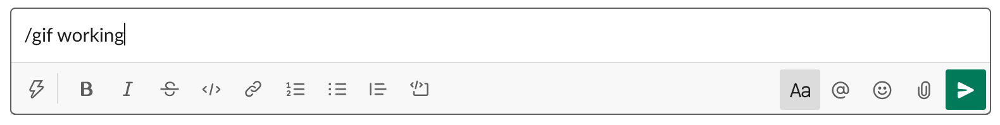
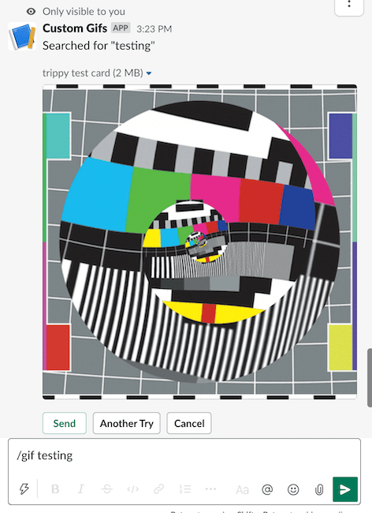

# Custom Gif Search for Slack

> Allows you to have your own collection of gifs that you can search and post to slack with a simple command.




## Usage

1. [Setup Gif Server](#setup-gif-server)
1. [Deploy somewhere](#deploy-somewhere)
1. [Configure Slack](#configure-slack)
1. [Try it out](#try-it-out)
1. [Add some extra gifs](#add-some-extra-gifs)

### Setup Gif Server

Before you can use the slack command, you need a HTTP server that serves some gifs and a meta.json containing information about them.

You can use https://github.com/Pezmc/custom-gifs-gif-repo to host such a server using GitHub Pages.

Once that's set up and you have the URL of your server, follow the next steps!

### Deploy Somewhere

Deploy the code from this repo to a server, it comes ready to use with Heroku

```bash
heroku create
git push heroku main
```

### Configure Slack

1. Create an app at [https://api.slack.com/apps](https://api.slack.com/apps)
1. Add a Slash command
1. Enable Interactive components
1. Navigate to the **OAuth & Permissions** page and select the following bot token scopes:
   - `commands`
   - `chat:write`
   - `chat:write.customize`
1. Click 'Save Changes' and install the app (You should get an OAuth access token after the installation)

#### Add a Slash Command

1. Go back to the app settings and click on Slash Commands.
1. Click the 'Create New Command' button and fill in the following:
   - Command: `/gif`
   - Request URL: Your server URL + `/command`
   - Short description: `Search for a gif`
   - Usage hint: `[search terms]`

If you're using Heroku, your URL will be something like: `http://[your-instance-name].herokuapp.com/command`.

#### Enable Interactive Components

1. Go back to the app settings and click on Interactive Components.
1. Set the Request URL to your server URL + `/request`.
1. Save the change.

#### Set Your Credentials

1. Set the following environment variables to `.env` (see `.env.example`):
   - `SLACK_SIGNING_SECRET`: Your app's Signing Secret (available on the **Basic Information** page)
   - `GIFS_SERVER`: The URL to your gifs server (you can use GitHub Pages)
   - For Heroku you'll need to use
     - `heroku config:set SLACK_SIGNING_SECRET=<your-secret>`
     - `heroku config:set GIFS_SERVER=your-server.github.io/and-repo/`
1. If you're running the app locally, run the app (`npm start`)

### Try It Out

Head to your Slack workspace and type the Slash command you setup above, for example:

```
/gif testing
```

You should see an interactive block where you can send, search again, or cancel.



If you head directly to your hosted instance, it'll link you to your gif server to see all the loaded gifs.

For Heroku that would be `http://[your-instance-name].herokuapp.com/`

### Add some extra gifs

Head back to your gifs repo set-up in step 1 to add more gifs, they'll show up in Slack about five minutes after deploy.
